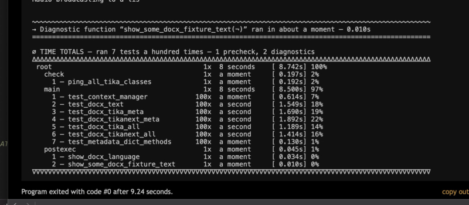
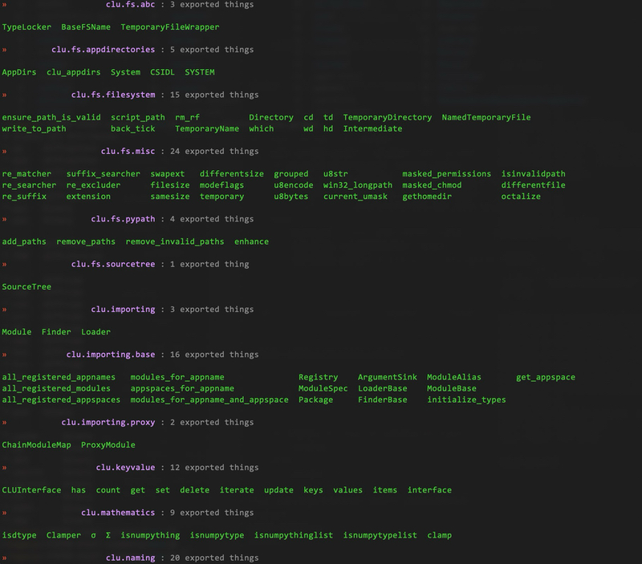

[Python-CLU][clu] – Common Lightweight Utilities
========================================================

[](https://codecov.io/gh/fish2000/CLU/)

Install it right now! [Download][download-link] or type: `$ pip install -U python-clu`
------------------------------------------------------------------------------

The deal with CLU is, it is a bunch of stuff. Like, a junk drawer… but a junk drawer
full of building sets: [Legos][lego-link], [Robotix][robotix-link], [Capsela][capsela-link]
– and also magic interfaces that let somehow you plug Legos into Capselas and all
that. It’s a la carte: you can use one part of CLU (say the [inline testing stuff][clu.testing.utils])
and ignore the rest. Or just the [`exporter`][clu.exporting], or just the [`predicates`][clu.predicates]
collection. Naturally, these things taste great and also taste great together, too.

[](https://www.reddit.com/r/Xennials/comments/1aixaq7/construx_and_capsela_anyone_else_have_any/)

CLU started out as a packaged-up and sanely written version of
[the Python tools I wrote for my REPLs][homage-replutilities-link], divided up into
a bunch of subordinate packages. It’s grown magnificently since then (if I do say so myself).
And if you are wondering if “CLU” is a Tron reference, [you are correct][clu-tron-link].
“CLU” stands for “Common Lightweight Utilities” – it started out as an acronym for
“Command-Line Utilities” but it has grown useful beyond that scope, indeed.

The subordinate packages are pretty well-divided: [`clu.config`][clu.config] contains
things to help with configuration, like [config-file loading and saving][clu.config.filebase],
and data structures like [our famous namespaced keymaps][clu.config.keymap].
[`clu.exporting`][clu.exporting] has the `@export` decorator, a utility to easily label module
members for export by adding them to a modules’ `__all__` and `__dir__` members,
plus other stuff like real-name determination. Which, speaking of which, [`clu.naming`][clu.naming]
has additional easy functions for dealing with the names of your things and other peoples’,
and [`clu.repr`][clu.repr] has stuff for easily printing, getting, and specifying an objects’
string representation.

You’ll like [`clu.abstract`][clu.abstract] if you like building class towers – we have ABCs
for all types of things. If you like [`dict`s][dicts], check out the aforementioned [`clu.config.keymap`][clu.config.keymap]
and [`clu.dicts`][clu.dicts] modules – you’ll find things to build dictionary types, represent
them, and deal with them later. [`clu.dispatch`][clu.dispatch] will help you manage
subprocesses easily, [`clu.version`][clu.version] is better then [`semver`][semver-link]
(I promise), [`clu.testing`][clu.testing] is great for inlining some quick unit tests, and
[`clu.scripts`][clu.scripts] and [`clu.repl`][clu.repl] are what you want for whatever your
REPL environment may be… [`bpython`][bpython-link], [`ipython`][ipython-link],
[`ptpython`][ptpython-link], and many others I am sure!

So do have a look around. Here’s an abridged breakdown of some things within:

* [`config`][clu.config]: Tons of useful things for dealing with your app’s configuration. These are centered
    around lexically namespaced dictionaries called “KeyMaps”, which basic examples of which can be
    found in [`clu.config.keymap`][clu.config.keymap]. If your nested data looks like:

    ```python
    data = {
        'yo' : {
            'dogg' : {
                'i-heard' : {
                    'you-like' : "nested data"
                }
            }
        }
    }
    ```
    
    … and you assign it to a keymap, like e.g. `keyed = keymap.Nested(data).flatten()`, then you can
    use `keyed` like so:
    
    ```python
    assert keyed["yo:dogg:i-heard:you-like"] == "nested data"
    ```
    
    … The `Flat` and `Nested` classes are cheap to construct and lightweight, and generally act like most
    [`dict`][dicts] instances in most of the expected ways. There is also an environment-variable [`keymap`][clu.config.keymap]
    adapter in [`clu.config.env`][clu.config.env], which if your app uses environment variables that look like like
    `MYAPP_CONFIG_THINGY`, they can be accessed through `env.FrozenEnviron(appname='myapp')` or
    `env.Environ(appname='myapp')` like so:
    
    ```python
    appenv = Environ(appname='myapp')
    assert appenv['config:thingy'] == "some value"
    appenv['config:doohickey'] = "a different value" # sets MYAPP_CONFIG_DOOHICKEY
                                                     # in the current env
    ```
    
    … and there are plenty of tools for rolling your own `KeyMap`s in [`clu.config`][clu.config]: the
    [`proxy`][clu.config.proxy] subpackage has a `KeyMap` proxy class, [`ns`][clu.config.ns] has utility functions
    for manipulating namespace strings, [`keymaputils`][clu.config.keymaputils] has more general utility functions (right now
    the `freeze`/`thaw` functions live there), [`keymapview`][clu.config.keymapview] has a class tower for
    [`KeyMap`][clu.config.keymap] key/value/item views, and [`abc`][clu.config.abc] has, as you’d expect, all
    the abstract base classes upon which our [`KeyMap`s][clu.config.keymap] are built, for your perusal and
    eventual enjoyment.

* [`constants`][clu.constants]: Definitions of [useful constants][clu.constants.consts], as well as
    [polyfills][clu.constants.polyfills] to allow certain dependencies from the Python standard library to work even
    when some of their moving parts are missing (i.e. Ye Olde Pythone 2.7, various PyPy implementations, etc).

* [`all`][clu.all]: Herein you will find some verrrrry interesting “meta” functions for CLU. You have the `import_all_modules(…)`
    function, which when provided your projects’ base path and appname, will return all the package names therein,
    whether class-based modules defined through [`clu.exporting`][clu.exporting] or plain ol’ modules defined by files
    ending in “.py”, basically. It’s awesome.
    
    The companion function `import_clu_modules(¬)` is a shortcut just for everything within CLU, and `inline_tests(…)`
    yields an iterator over every CLU module that defines inline tests through [`clu.testing`][clu.testing]. These
    are very useful within CLU; for your own project, write your own functions modeled after these! You can’t go wrong.

* [`fs`][clu.fs]: Filesystem-related things. Submodules include:
    
    * [`fs.filesystem`][clu.fs.filesystem]: classes representing filesystem primitives like `Directory`,
        `TemporaryDirectory`, `TemporaryName`; a version of [`tempfile.NamedTemporaryFile`][tempfile.NamedTemporaryFile]
        that works with or without the leading dot in the provided suffix (a peeve of mine); functions
        for common filesystem operations like `which(…)`,  `back_ticks(…)`, `rm_rf(…)` (be careful
        with that one), and so forth. 
        
        * The `Directory` class is particularly extensive, with methods for [Zipfile][zipfile] archiving, searching
            for importable Python files and others, file-suffix histograms, context-managed working-directory
            management, walking and reverse-walking, and much more.
    
    * [`fs.appdirectories`][clu.fs.appdirectories]: Started out as a pretty much wholesale duplication of the popular
        [`appdirs`][appdirs-link] package[<sup>†</sup>](#dagger) – but it’s been kitted out with many CLUish things, e.g.
        [`clu.fs.filesystem.Directory`][clu.fs.filesystem] instances. A solid upgrade in my opinion!
    
    * [`fs.misc`][clu.fs.misc]: a bunch of useful miscellany – noteworthy standouts include regex utility functions for
        constructing filename regex match or exclusion tests.
    
    * [`fs.pypath`][clu.fs.pypath]: functions for safe manipulation of [`sys.path`][sys.path] – `enhance(…)`,
    `remove_paths(…)`, `remove_invalid_paths()`, &c.
    
* [`importing`][clu.importing]: a whole class-based-module system! Basically you can do this:

    ```python
    class Derived(clu.importing.base.Module):
    
        """ I heard you like docstrings """
    
        yo = 'dogg'
    
        @export
        def yodogg(self):
            return "I heard you like"
    
        @export
        def nodogg(self):
            return None
    
        export(yo, name='yo')
    
    from clu.app import Derived as derived # TAKE NOTE!!!
    
    assert isinstance(derived, Module)
    assert derived.yo == 'dogg'
    assert derived.yodogg() == "I heard you like"
    assert derived.nodogg() is None
    ```

    … see that? just by subclassing [`clu.importing.base.Module`][clu.importing.base] you can create something
    instantly importable. Awesome, wouldn’t you say? I would say. We’re working out the best way to create the
    base `Module` for your own project (the machinery is there but the semantics are not yet perfect) but do feel
    free to play around with the stuff in [`clu.importing.base`][clu.importing.base], and have a look at the
    implementation in [`clu.importing.proxy`][clu.importing.proxy] of the “parameterized” `ProxyModule` (there’s a
    `ChainModuleMap` container available in the [`proxy`][clu.importing.proxy] submodule, too).

* [`repl`][clu.repl] and [`scripts`][clu.scripts]: Tools useful in Python REPL environments. In [`clu.repl`][clu.repl],
    there’s a while module full of ANSI printing and formatting utilities, many of them as classes, a [`columnize`][clu.repl.columnize]
    function for, uh, printing things in columns[<sup>†</sup>](#dagger), and a [`modules`][clu.repl.modules] submodule
    focused on printing things about your project’s modules and submodules.
    
    [`clu.scripts`][clu.scripts] contains a [“repl.py”][clu.scripts.repl] file, which is meant to be loaded into an interactive interpreter like e.g.:
    
    ```bash
    $ bpython -i «PATH_TO_CLU»/clu/scripts/repl.py
    ```
    
    … which will set all of CLU up for you to use interactively. N.B. if you have your own script you want to include
    but stil want to use CLU, you can set the `CLU_USER_SCRIPT` environment variable to the path to your own script,
    and our “repl.py” script will pick it up. 
    
    [`clu.scripts`][clu.scripts] also contains [`treeline`][clu.scripts.treeline] and [`dictroast`][clu.scripts.dictroast], which
    are CLU’s nascent command-line parsing utilities. They make use of the CLU `KeyMap` idiom (q.v. note _supra_)
    and are being worked on right this very µsecond!

* [`typespace`][clu.typespace]: Contains a submodule `typespace.namespace` defining `SimpleNamespace` (á la Python 3’s
    [`types.SimpleNamespace`][types.SimpleNamespace]) and a slightly more useful `Namespace` ancestor class;
    these are used to furnish a `typespace.types` namespace that contains everything in  the standard-library
    [`types`][types] module, but with all the typenames shortened so they no longer gratuitously end in “Type”. Like e.g.
    [`types.ModuleType`][types.ModuleType] is to be found in `typespace.types.Module`, [`types.FunctionType`][types.FunctionType]
    is `typespace.types.Function`, et cetera, ad nauseum, so you can just do `from clu.typespace import types`
    to lose the redundant “Type” naming suffix – which I don’t know about you but that annoys me, I mean we all know
    that these things are types because they are in the fucking [`types`][types] module and don’t need those overly
    verbose extra four characters there at the end. ALSO, there are additional useful types, from Python’s standard
    library and common packages, in the [`types` namespace][clu.typespace.namespace]. YOU’RE WELCOME!!

* [`enums`][clu.enums]: Furnishes  `alias(…)` – which, spoiler alert, let you create aliases within your enums!
    Oh yes. Like so:
    
    ```python
    
    from clu.enums import alias
    
    @unique
    class Numbers(Enum):
        ONE = 1
        TWO = 2
        THREE = 3
        UNO = alias(ONE)
        DOS = alias(TWO)
        TRÉS = alias(THREE)
    
    assert Numbers.ONE == Numbers.UNO
    assert Numbers.TWO == Numbers.DOS
    assert Numbers.THREE == Numbers.TRÉS
    
    ```
    
    … aaaaand BOOM, there you go! The `alias` members of an enum don’t show up when iterating the
    enum’s members, so they’re for your convenience. For a fantastic CLUish real-life example, have a look at
    the [`clu.repl.ansi`][clu.repl.ansi] module, and [the enums it defines][clu.repl.ansi.enums] – these use a metaclass
    to line the enum’s standard members up with some predefined class attributes defined in a third-party module;
    we use `alias(…)` to provide more obvious lexical aliases of these attributes. Yes!

* [`dicts`][clu.dicts]: Functions and classes for wrangling [`dict`s][dicts] (and actually [`Mapping`][collections.abc.Mapping]
    and [`MutableMapping`][collections.abc.MutableMapping] descendants in general). There are ABCs for
    key/value/item views for your own mappings, a much better `ChainMap`, written from scratch and improving
    on [`collections.ChainMap`][collections.ChainMap], plus a `ChainRepr` based on [`reprlib.Repr`][reprlib.Repr],
    and a whole bunch of fast dict-merging functions.

* [`exporting`][clu.exporting]: This is kind of the heart of CLU. At the beginning of all internal CLU modules, you’ll find something
    using the `Exporter`, like this:
    
    ```python
    from clu.exporting import Exporter
    
    exporter = Exporter(path=__file__)
    export = exporter.decorator()
    ```
    … which I know, I know, the use of `__file__` there is kind of irritating. But that `exporter` instance is now
    registered with CLU, and whenever there’s a class or function you want made available outside the module,
    you can specify it like:
    
    ```python
    @export
    def public_function():
        print("I’m so public")
        
    class PrivateAncestor:
        """ I’m more private, don’t play with me """
        
    @export
    class PublicThing(PrivateAncestor):
        """ I’m very public, indeed, and available """
    ```
    
    At the end of the module (but before your CLU tests, q.v. note _sub_.) you put:
    
    ```python
    __all__, __dir__ = exporter.all_and_dir()
    ```
    
    … which makes things clear what is public and what is private to consumers of your code, without messing
    around with underscore prefixes, which I find coarse, and vulgar. You’re not just labeling things for export,
    though: [`clu.exporting`][clu.exporting] has tons of machinery for finding out the **“true name”** of a thing,
    be it a class (easy), a function (trickier but still easy), an instance (trickier still), and a module variable (totally
    very tricky indeed).
    
    For your own project, at some part in your code, all you have to do is: `from clu.exporting import ExporterBase`,
    and then subclass `ExporterBase` with your app’s name and base path. Like so:
    
    ```python
    class Exporter(ExporterBase, basepath="/your/project", appname="MyProject"):
        pass
    ```
    
    … then import your own importer (or call it whatever you want) at the top of your own CLUish modules and
    instantiate per the example _supra_. See also [`clu.scripts.dictroast`][clu.scripts.dictroast] for other tricks your
    `Exporter` instances can perform. 

* [`testing`][clu.testing]: a handy inline unit-test writing setup. It works fine with [`coverage`][coverage-link] and
    [`pytest`][pytest-link] – all you have to do is, after your line assigning `__all__` and `__dir__` at the end
    of the module proper, something like:
    
    ```python
    def test():
        from clu.testing.utils import inline
    
        @inline.precheck
        def before_everything_else():
    	    """ This function runs once before testing """
            # ...
            
        @inline
        def first_test():
            """ This test does one thing """
            # ...
            
        @inline
        def second_test():
    	    """ This test does another thing """
            # ...
            
        @inline.runif(something == something_else)
        def test_conditionally_run():
    	    """ This test only does something if `something` == `something_else` """
            # ...
            
        @inline.diagnostic
        def apres_testing():
    	    """ This function runs once after testing """
            # ...
            
        return inline.test(100)
    
    if __name__ == '__main__':
        sys.exit(test())
    ```

    … running the module (with either `python -m yourapp.yourmodule` or, say, [Nox][nox-link]) will show
    you each tests’ output. But see that `return inline.test(100)` line? That integer argument tells
    the CLU testrunner how many times to run each test (we here like to go a hundred times). You’ll get a
    report – each test function only prints its output on the first run, the other 99 in this case are muted –
    that shows you the time totals, which will look like this:
    
    [](https://github.com/fish2000/CLU/tree/master/scratch/images/clu-testing-time-totals-example.jpg)
    
    … which the astute will note is the output from a non-CLU module. [`clu.testing.utils`][clu.testing.utils]
    is very easy to integrate, as it doesn’t require any other part of CLU. Look over [our noxfile][clu-noxfile] for
    examples of how to run your inline tests as part of a larger suite.
    
    … there are other testing support tools in[ `clu.testing.utils`][clu.testing.utils], have a look. There’s
    also a [`clu.testing.pytest`][clu.testing.pytest] submodule, with some currently-under-development
    [`pytest`][pytest-link] plugins.

* [`mathematics`][clu.mathematics]: the future home for math-related stuff. All there is right now is a `clamp(…)` function that works with
    [`numpy`][numpy-link] [dtypes][numpy-dtype-link].

* [`naming`][clu.naming]: functions for determining the names of things (even module constants and other random things
    that generally lack things like `__name__` attributes) and for the importing and exporting of things by
    “qualified names” – for instance, you can use `naming.qualified_import(…)` to import a class [`CurveSet`][instakit.processors.curves.CurveSet]
    from its package [`instakit.processors.curves`][instakit.processors.curves] by doing:
    
    ```python
    CurveSet = qualified_import('instakit.processors.curves.CurveSet')
    ```
    
    … which that may be handier for you than composing and hard-coding an `import` statement. See also the
    `nameof(…)` and `moduleof(…)` functions, and the utility functions (e.g. `qualified_name(…)`) and
    predicates (e.g. `isnative(…)`). Most of these functions take literally anything for their argument.

* [`predicates`][clu.predicates]: If [`clu.exporting`][clu.exporting] is the heart, [`clu.predicates`][clu.predicates] is
    all of the eyes, ears, fingers and toes of CLU.
    
    * Do you want to know if a class is a metaclass? We have an `ismetaclass(…)` predicate for it, for example.
    * Do you want to get an attribute from something you have, but not sure which attributes this _something_
    may have (due to versioning or being passed around, or whatever)? `attr(thing, 'one', 'two', default=None)`
    will give you `thing.one` if that exists, `thing.two`, if `thing.one` doesn’t, and `None` if neither of them
    are there.
    * But… would you maybe like to get a tuple with all of the `one` attributes across multiple things?
    `attr_across('one', *things)` will do exactly that.
    * Similar to the above, `pyattr(…)` does like `attr(…)` except `one` will be expanded to `__one__`, and
    `item(…)` searches over mapping keys rather than attribute names. 
    
    Sweet, right? These functions, and others in the [`predicates`][clu.predicates] module, are based on `accessor`,
    `aquirer`, `searcher`, and `collator` – abstract functions that can themselves be used. In fact most of
    [`clu.predicates`][clu.predicates] is written in the functional style – that is to say they are built successively
    out of multiple `lambda` statements. If this is not your taste, everything there has been documented thoroughly
    for your use and you shouldn’t have to program in this style. But… if you _do_ enjoy a spot of FP, the primitives
    in the module perhaps will interest you more than the more utilitarian contents.

* [`sanitizer`][clu.sanitizer]: functions for cleaning up unicode. Right now there is just a list-based `sanitize(…)`
    function that tones down anything with high-value code points to the point where it can be safely `ascii`-ified. 

* [`trie`][clu.trie]: A relative newcomer, [`clu.trie`][clu.trie] is a toolkit for building trie-search type custom
    systems for parsing specific things, i.e. error strings, program output… [`clu.config.keymap`][KeyMap keys] maybe,
    who knows. It’s all shiny and new (meaning: the current contents will fail to blow your mind); if tries and/or other
    similar tree-search dark arts are, like, your thing: do hit me up with suggestions or samples, or PULL REQUESTS!!
    How do I love pull requests. I’ll toast your name for life, if you were to send me one good PR. On this or anything
    else (you’re heartily invited to nitpick my abundantly horrid spelling errors too if you are into that). Yes!
  
* [`typology`][clu.typology]: This is like [`clu.predicates`][clu.predicates] but with more predicates, many of which are
    based on typelists. The module is full of typelists and it uses them extensively in its predicates, via `isinstance(…)`,
    `issubclass(…)` and a custom version of same called `subclasscheck(…)` which tries very hard to work with
    what you give it (instead of just crapping out with a `False` return value). You will want to explore this one!

* [`version`][clu.version]: This is basically my take on the [`semver`][semver-link] package, only with improvements.
    I originally developed it for internal use in some of my Python projects, but it stands on its own. You can
    construct [`clu.version.VersionInfo`][clu.version.VersionInfo] instances using [`semver`][semver-link]
    primitives amongst other things. The (skeletal) [`git_version`][clu.version.git_version] subpackage has a
    couple of [Git-related][git-link] functions, but what you really want is in [`read_version`][clu.version.read_version]
    – therein you’ll find a `read_version_file(…)` function that uses the `ast` module to read one of those
    `__version__.py` files I know you have lying around. Yes[<sup>†</sup>](#dagger)!

* [The `pytest` testsuite][clu-testsuite]: CLU has a full set of [`pytest`][pytest-link]-compatible unit tests.
    In addition to copious module-specific [CLU inline tests][clu.testing], you can run this test suite using
    [`pytest`][pytest-link] – or, if you’d like to run *all* the tests, use the fantastic [Nox][nox-link] testrunner
    (which we use) along with [our included noxfile][clu-noxfile].

… AND MORE!!! There really are a ton of useful things in here and one day I will list them (but not today). 
    Have fun with it!! [Download][download-link] CLU today and explore – if you want a full list of everything CLU
    exports, install it and list them all in your terminal:

    $ pip install -U python-clu
    $ python -m clu

… which will give you a giant list that looks like this:

[](https://pypi.org/project/python-clu/)

<a name="dagger" style="text-decoration: none;">†</a> – the original code for some modules in CLU (e.g.
    [`clu.fs.appdirectories`][clu.fs.appdirectories], [`clu.repl.columnize`][clu.repl.columnize],
    [`clu.version.read_version`][clu.version.read_version]) was vendored in from third-party code.
    This has all been appropriately licensed and credits are inlined where due. Thanks to all CLU
    contributors, big and small!

<!--- LINKS! LINKS! LINKS! -->
[pypi-link]: https://pypi.org/project/python-clu/
[download-link]: https://github.com/fish2000/CLU/archive/refs/heads/master.zip
[homage-replutilities-link]: https://github.com/fish2000/homage/blob/master/.script-bin/replutilities.py
[clu-tron-link]: https://tron.fandom.com/wiki/Clu

[appdirs-link]: https://github.com/ActiveState/appdirs
[coverage-link]: https://coverage.readthedocs.io/en/latest/
[git-link]: https://git-scm.com
[numpy-link]: https://numpy.org
[numpy-dtype-link]: https://numpy.org/doc/stable/user/basics.types.html
[bpython-link]: https://bpython-interpreter.org
[ipython-link]: https://ipython.org
[ptpython-link]: https://github.com/prompt-toolkit/ptpython
[semver-link]: https://pypi.org/project/semver/
[pytest-link]: https://docs.pytest.org/en/stable/
[nox-link]: https://nox.thea.codes/en/stable/
[lego-link]: https://www.lego.com/
[capsela-link]: https://hackaday.com/2017/09/15/retrotectactular-capsela-is-dead-long-live-capsela/
[robotix-link]: https://en.wikipedia.org/wiki/Robotix

[clu.config]: https://github.com/fish2000/CLU/tree/master/clu/config
[clu.config.abc]: https://github.com/fish2000/CLU/tree/master/clu/config/abc.py
[clu.config.env]: https://github.com/fish2000/CLU/tree/master/clu/config/env.py
[clu.config.filebase]: https://github.com/fish2000/CLU/tree/master/clu/config/filebase.py
[clu.config.keymap]: https://github.com/fish2000/CLU/tree/master/clu/config/keymap.py
[clu.config.keymapview]: https://github.com/fish2000/CLU/tree/master/clu/config/keymapview.py
[clu.config.ns]: https://github.com/fish2000/CLU/tree/master/clu/config/ns.py
[clu.config.proxy]: https://github.com/fish2000/CLU/tree/master/clu/config/proxy.py
[clu.config.keymaputils]: https://github.com/fish2000/CLU/tree/master/clu/config/keymaputils.py

[clu.constants]: https://github.com/fish2000/CLU/tree/master/clu/constants
[clu.constants.consts]: https://github.com/fish2000/CLU/tree/master/clu/constants/consts.py
[clu.constants.polyfills]: https://github.com/fish2000/CLU/tree/master/clu/constants/polyfills.py

[clu.fs]: https://github.com/fish2000/CLU/tree/master/clu/fs
[clu.fs.abc]: https://github.com/fish2000/CLU/tree/master/clu/fs/abc.py
[clu.fs.appdirectories]: https://github.com/fish2000/CLU/tree/master/clu/fs/appdirectories.py
[clu.fs.filesystem]: https://github.com/fish2000/CLU/tree/master/clu/fs/filesystem.py
[clu.fs.misc]: https://github.com/fish2000/CLU/tree/master/clu/fs/misc.py
[clu.fs.pypath]: https://github.com/fish2000/CLU/tree/master/clu/fs/pypath.py

[clu.importing]: https://github.com/fish2000/CLU/tree/master/clu/importing
[clu.importing.base]: https://github.com/fish2000/CLU/tree/master/clu/importing/base.py
[clu.importing.proxy]: https://github.com/fish2000/CLU/tree/master/clu/importing/proxy.py

[clu.repl]: https://github.com/fish2000/CLU/tree/master/clu/repl
[clu.repl.ansi]: https://github.com/fish2000/CLU/tree/master/clu/repl/ansi.py
[clu.repl.ansi.enums]: https://github.com/fish2000/CLU/blob/c5be3edcea7774b0d042b13125458fef6bd8a303/clu/repl/ansi.py#L150-L222
[clu.repl.banners]: https://github.com/fish2000/CLU/tree/master/clu/repl/banners.py
[clu.repl.columnize]: https://github.com/fish2000/CLU/tree/master/clu/repl/columnize.py
[clu.repl.modules]: https://github.com/fish2000/CLU/tree/master/clu/repl/modules.py

[clu.scripts]: https://github.com/fish2000/CLU/tree/master/clu/scripts
[clu.scripts.dictroast]: https://github.com/fish2000/CLU/tree/master/clu/scripts/dictroast.py
[clu.scripts.repl]: https://github.com/fish2000/CLU/tree/master/clu/scripts/repl.py
[clu.scripts.treeline]: https://github.com/fish2000/CLU/tree/master/clu/scripts/treeline.py

[clu.testing]: https://github.com/fish2000/CLU/tree/master/clu/testing
[clu.testing.pytest]: https://github.com/fish2000/CLU/tree/master/clu/testing/pytest.py
[clu.testing.utils]: https://github.com/fish2000/CLU/tree/master/clu/testing/utils.py

[clu.typespace]: https://github.com/fish2000/CLU/tree/master/clu/typespace
[clu.typespace.namespace]: https://github.com/fish2000/CLU/tree/master/clu/typespace/namespace.py

[clu.version]: https://github.com/fish2000/CLU/tree/master/clu/version
[clu.version.git_version]: https://github.com/fish2000/CLU/tree/master/clu/version/git_version.py
[clu.version.read_version]: https://github.com/fish2000/CLU/tree/master/clu/version/read_version.py
[clu.version.VersionInfo]: https://github.com/fish2000/CLU/blob/9f64200a947dbdcbf7eca44b87d0d9efeb4c6de7/clu/version/__init__.py#L100-L248

[clu]: https://github.com/fish2000/CLU
[clu-testsuite]: https://github.com/fish2000/CLU/tree/master/tests
[clu-noxfile]: https://github.com/fish2000/CLU/blob/master/noxfile.py

[clu.abstract]: https://github.com/fish2000/CLU/tree/master/clu/abstract.py
[clu.all]: https://github.com/fish2000/CLU/tree/master/clu/all.py
[clu.application]: https://github.com/fish2000/CLU/tree/master/clu/application.py
[clu.csv]: https://github.com/fish2000/CLU/tree/master/clu/csv.py
[clu.dicts]: https://github.com/fish2000/CLU/tree/master/clu/dicts.py
[clu.dispatch]: https://github.com/fish2000/CLU/tree/master/clu/dispatch.py
[clu.enums]: https://github.com/fish2000/CLU/tree/master/clu/enums.py
[clu.exporting]: https://github.com/fish2000/CLU/tree/master/clu/exporting.py
[clu.extending]: https://github.com/fish2000/CLU/tree/master/clu/extending.py
[clu.keyvalue]: https://github.com/fish2000/CLU/tree/master/clu/keyvalue.py
[clu.mathematics]: https://github.com/fish2000/CLU/tree/master/clu/mathematics.py
[clu.naming]: https://github.com/fish2000/CLU/tree/master/clu/naming.py
[clu.predicates]: https://github.com/fish2000/CLU/tree/master/clu/predicates.py
[clu.repr]: https://github.com/fish2000/CLU/tree/master/clu/repr.py
[clu.sanitizer]: https://github.com/fish2000/CLU/tree/master/clu/sanitizer.py
[clu.stdio]: https://github.com/fish2000/CLU/tree/master/clu/stdio.py
[clu.trie]: https://github.com/fish2000/CLU/tree/master/clu/trie.py
[clu.typology]: https://github.com/fish2000/CLU/tree/master/clu/typology.py

[instakit]: https://github.com/fish2000/instakit
[instakit.processors.curves]: https://github.com/fish2000/instakit/blob/master/instakit/processors/curves.py
[instakit.processors.curves.CurveSet]: https://github.com/fish2000/instakit/blob/ad5591c88176c2c997d86833b93dde017545277f/instakit/processors/curves.py#L109-L240
[collections.abc.Mapping]: https://docs.python.org/3/library/collections.abc.html#collections.abc.Mapping
[collections.abc.MutableMapping]: https://docs.python.org/3/library/collections.abc.html#collections.abc.MutableMapping
[collections.ChainMap]: https://docs.python.org/3/library/collections.html#chainmap-objects
[reprlib.Repr]: https://docs.python.org/3/library/reprlib.html#reprlib.Repr
[sys.path]: https://docs.python.org/3/library/sys_path_init.html
[tempfile.NamedTemporaryFIle]: https://docs.python.org/3/library/tempfile.html#tempfile.NamedTemporaryFile
[types]: https://docs.python.org/3/library/types.html
[types.ModuleType]: https://docs.python.org/3/library/types.html#types.ModuleType
[types.FunctionType]: https://docs.python.org/3/library/types.html#types.FunctionType
[types.SimpleNamespace]: https://docs.python.org/3/library/types.html#additional-utility-classes-and-functions
[zipfile]: https://docs.python.org/3/library/zipfile.html
[dicts]: https://docs.python.org/3/tutorial/datastructures.html#dictionaries
